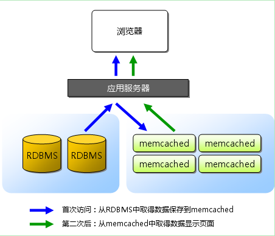

# 0 简介
- 高性能分布式内存对象缓存系统

- 旨在通过减轻数据库负载来加速动态Web应用程序

- 一般作为后端数据库的缓存层来减少数据库的压力

- 特点
    - 基于简单的文本行协议
    - 全部数据按照k/v形式存放在内存中，无持久化，重启服务数据会丢失
    - 基于libevent异步I/O模型的事件通知机制  
        libevent是个程序库，它将Linux的epoll、BSD类操作系统的kqueue等事件处理功能封装成统一的接口。即使对服务器的连接数增加，也能发挥O(1)的性能。memcached使用这个libevent库，因此能在Linux、BSD、Solaris等操作系统上发挥其高性能
    - 节点之间相互独立，实现分布式需要依赖客户端

- 图解


# 1 安装部署
## 1.1 安装依赖

```shell
yum install gcc libevent libevent-devel
```

## 1.2 源码安装

- [memcache下载地址](http://memcached.org/)

```shell
cd /usr/local/src/
wget http://memcached.org/files/memcached-1.5.2.tar.gz                                          
tar zxvf memcached-1.5.2.tar.gz
cd memcached-1.5.2
./configure --prefix=/usr/local/memcached && make && sudo make install                 
``` 

# 2 操作说明

```shell
# 启动memcahced
/usr/local/memcached/bin/memcached -d -m 256 -c 4096 -p 11211 -u www -t 10

# 关闭memcached
pkill -9 memcached

# 查看进程
ps -ef | grep memcache | grep -v grep
www 48076 1 0 16:06 ? 00:00:00 /usr/local/memcached/bin/memcached -d -m 256 -c 4096 -p 11211 -u www -t 10
```

- 基本命令
```shell
<command name> <key> <flags> <exptime> <bytes> [noreply]
cas <key> <flags> <exptime> <bytes> <cas unique> [noreply]


<command name>
    "set"
    "add"
    "replace"
    "append"
    "prepend"

<flags>
# 是服务器随数据一起存储的任意16位无符号整数（用十进制表示），并在检索项目时返回。 对于memcached的php客户端来说flags=0表示不压缩

```

- 启动参数说明

```shell
#选项说明，一下是比较重要和常用的选项；具体选项说明使用memcached -h来查阅
-p   # TCP端口，默认为11211，可以不设置
-U   # UDP端口，默认为11211，0为关闭
-l   # 监听的ip地址
-d   # 守护进程（daemon）
-u   # 指定用户，如果当前为 root ，需要使用此参数指定用户
-m   # 最大内存，单位MB。默认64MB，32位操作系统，每个进程最多只能使用2GB，64位无限制
-M   # 禁止LRU策略，内存耗尽时返回错误，而不是删除数据
-c   # 最大连接数，默认是1024
-vv  # 查看日志
-P   # memcache的pid文件，结束memcache进程：kill `cat /tmp/memcached_32054.pid`
-f   # 增长因子，默认1.25
-n   # 初始chunk=key+suffix+value+32结构体，默认48字节
-L   # 启用大内存页，可以降低内存浪费，改进性能
-t   # 线程数，默认4。由于memcached采用NIO，所以更多线程没有太多作用
-R   # 每个event连接最大并发数，默认20
-C   # 禁用CAS命令（可以禁止版本计数，减少开销）
-I   # 每次申请内存的页的大小（page），默认1M，最小1k，最大128M
-F   # 禁用flush_all
```

# 3 安全问题
服务器一般有两个网卡，一个指向内网，一个指向外网。
由于memcached没有密码验证，如果直接暴露在外网，数据就会随意被他人利用。

```shell
# 处理方法
# 方法一：网访问，启动memcached的时候加上-l参数，让memcached监听内网 ip
memcached -d -m 1024 -u root -l 192.168.56.10 -p 11211 -c 1024

# 方法二：设置防火墙
iptables -F
iptables -P INPUT DROP
iptables -A INPUT -p tcp -s 192.168.56.10 --dport 11211 -j ACCEPT
iptables -A INPUT -p udp -s 192.168.56.10 --dport 11211 -j ACCEPT
```

# 参考资料
[安装memcached](https://www.cnblogs.com/justlikeheaven/p/7718110.html)